# SkyGeni Assignment

This project analyzes client subscription and payment data to answer key business questions using Python and data visualization.

## Data Loading, Preprocessing, and Cleaning Steps

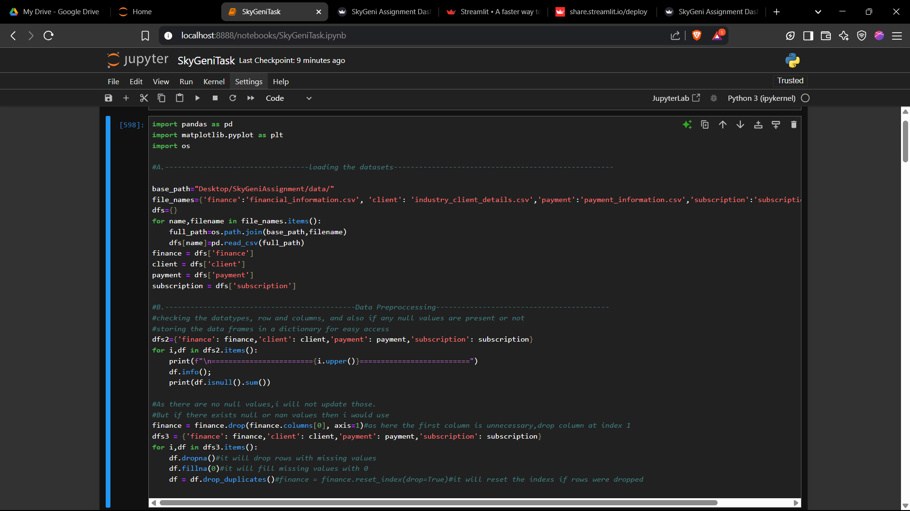
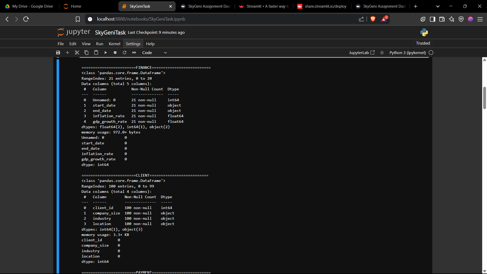
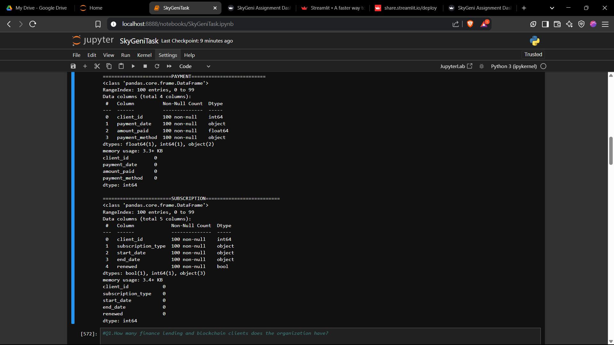

---

## 1. How many finance lending and blockchain clients does the organization have?

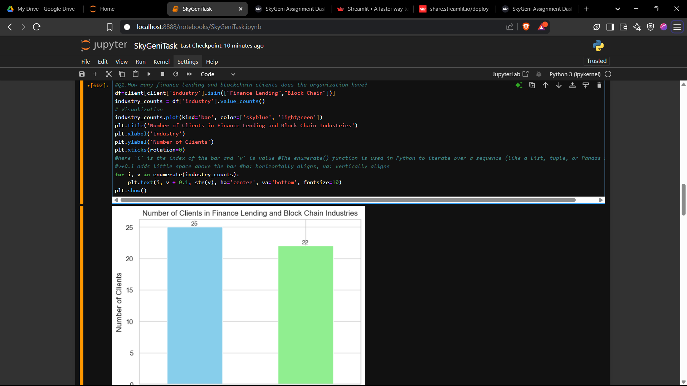
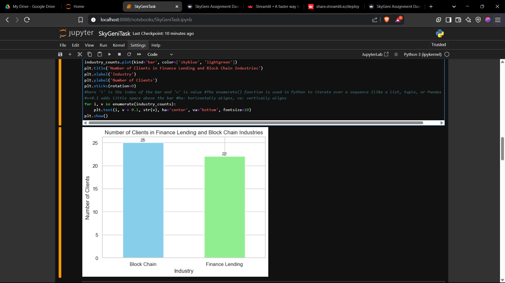

---

## 2. Which industry in the organization has the highest renewal rate?

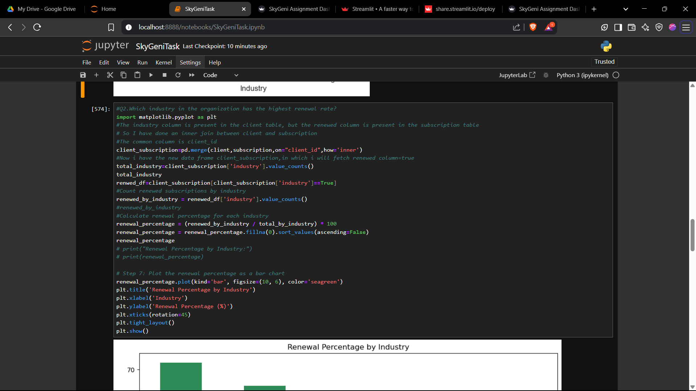
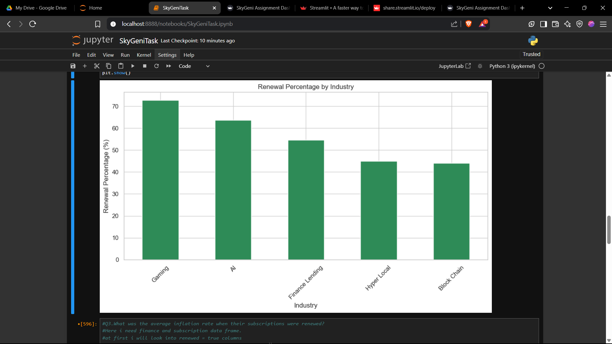

---

## 3. What was the average inflation rate when their subscriptions were renewed?

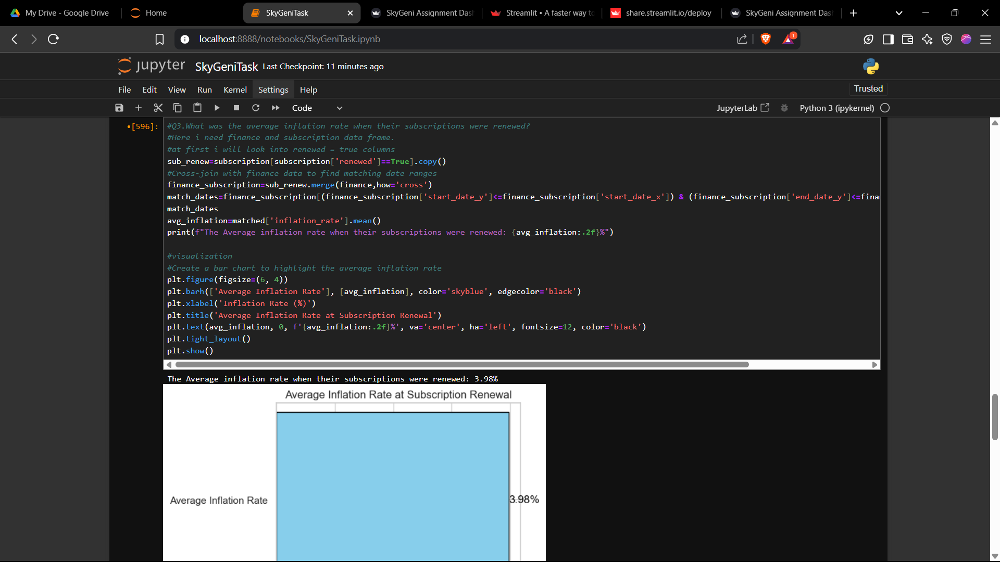
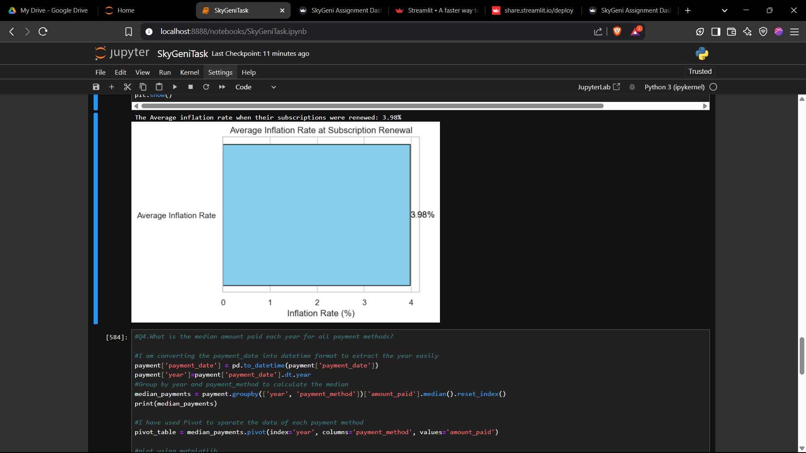

---

## 4. What is the median amount paid each year for all payment methods?

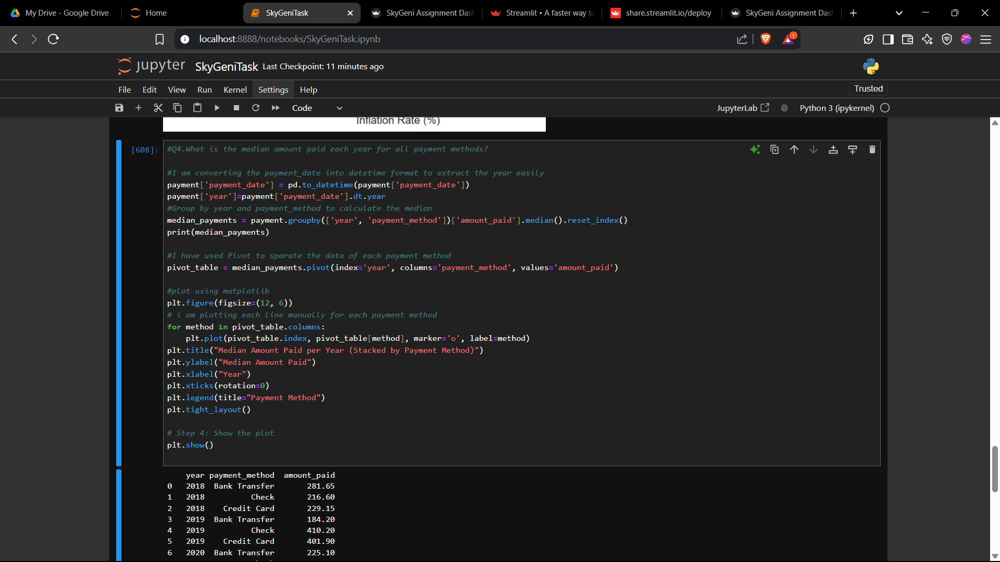
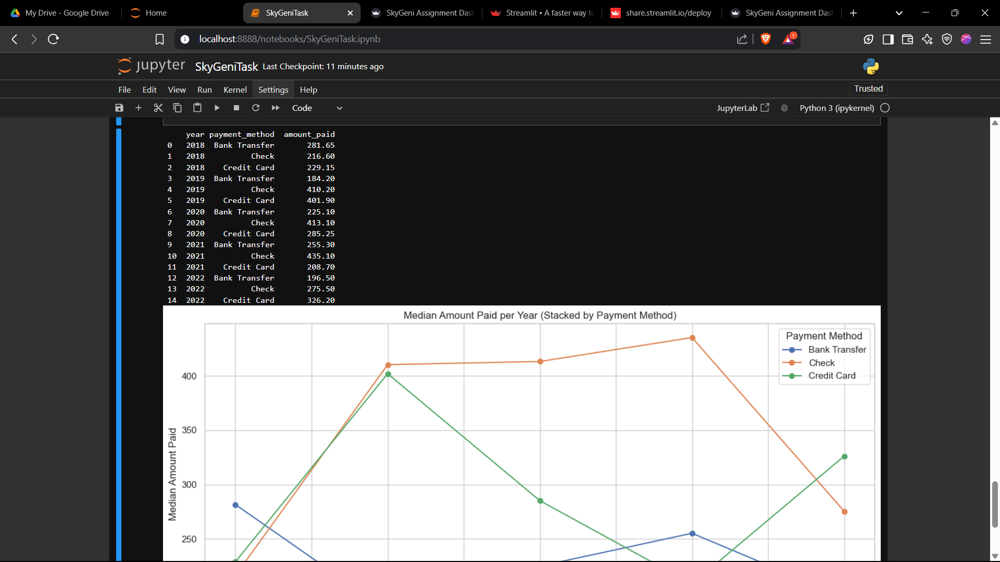
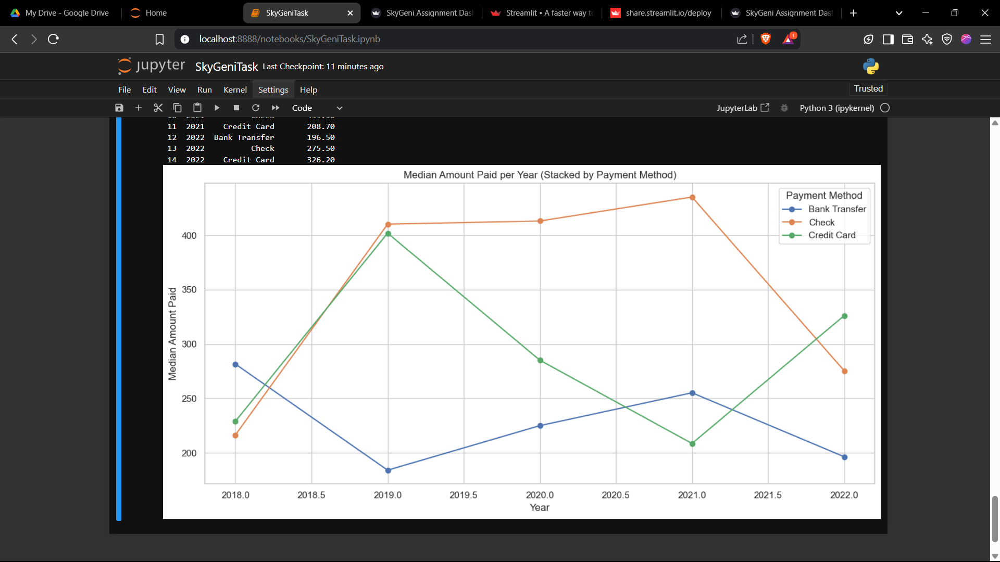

---

